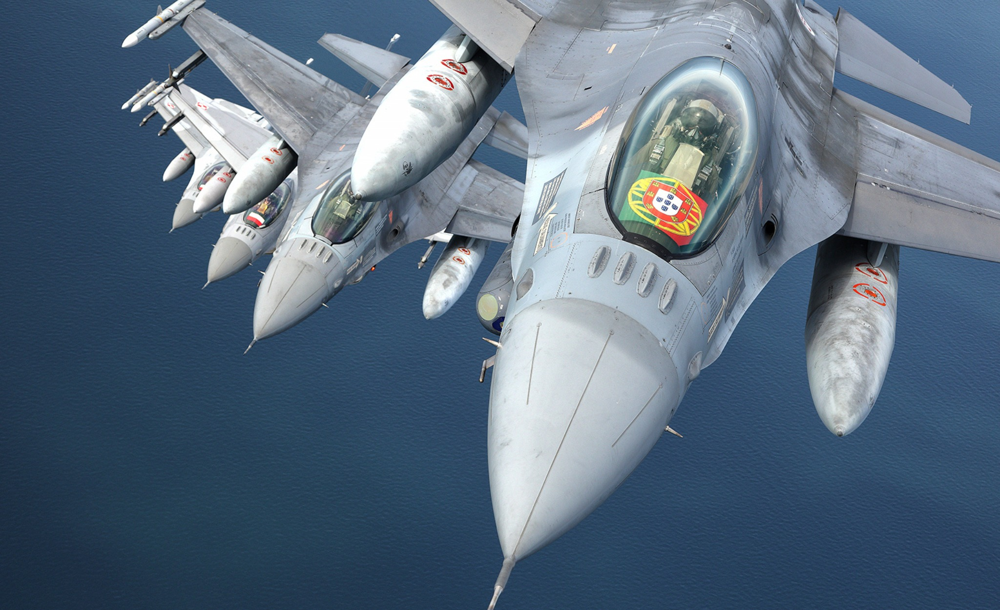

<h1 align="center">
    
</h1>

## A bit about me
- 📖 I read a bit of everything
- 🎞️ I love learning about History
- 👓 I'm currently learning **Cyber Security** at Polytechnic Institute of Beja
- 📤 Ask me anything **[here](https://github.com/zDragonPaulo/zDragonPaulo/issues)**
- 📧 Reach me at **zdragonpaulo@gmail.com**

### My Languages 

 

    

### My Work Tools

 

    

## ⚡️ Stats

 

  
  
  

